# 入门

入门岛

| <br>  |    关卡名称     |                                                                               关卡资料                                                                               |  通关激励  |
| ----- | --------------- | ------------------------------------------------------------------------------------------------------------------------------------------------------------------- | --------- |
| 第1关 | Linux 基础知识  | [任务](https://github.com/InternLM/Tutorial/blob/camp3/docs/L0/Linux/task.md)、[文档](https://github.com/InternLM/Tutorial/blob/camp3/docs/L0/Linux/readme.md)、视频 | 50 算力点 |
| 第2关 | Python 基础知识 | [任务](https://github.com/InternLM/Tutorial/blob/camp3/docs/L0/Python/task.md)、文档、视频                                                                           | 50 算力点 |
| 第3关 | Git 基础知识    | [任务](https://github.com/InternLM/Tutorial/blob/camp3/docs/L0/Git/task.md)、文档、视频                                                                              | 50 算力点 |

> 通关奖励：无

## 第1关 | Linux 基础知识 

### 任务
> [task.md](https://github.com/InternLM/Tutorial/blob/camp3/docs/L0/Linux/task.md)

**闯关任务需要在关键步骤中截图：**

|            |                  任务描述                   | 完成所需时间 |
| ---------- | ------------------------------------------- | ----------- |
| 闯关任务   | 完成SSH连接与端口映射并运行`hello_world.py`   | 10min       |
| 可选任务 1 | 将Linux基础命令在开发机上完成一遍             | 10min       |
| 可选任务 2 | 使用 VSCODE 远程连接开发机并创建一个conda环境 | 10min       |
| 可选任务 3 | 创建并运行`test.sh`文件                      | 10min       |

请将作业发布到知乎、CSDN等任一社交媒体，将作业链接提交到以下问卷，助教老师批改后将获得 50 算力点奖励！！！

提交地址：https://aicarrier.feishu.cn/share/base/form/shrcnZ4bQ4YmhEtMtnKxZUcf1vd

### 文档
> [readme.md](https://github.com/InternLM/Tutorial/blob/camp3/docs/L0/Linux/readme.md)

1. InternStudio开发机介绍
InternStudio 是大模型时代下的云端算力平台。基于 InternLM 组织下的诸多算法库支持，为开发者提供开箱即用的大语言模型微调环境、工具、数据集，并完美兼容 🤗 HugginFace 开源生态。

2. SSH及端口映射
3. Linux 基础命令
4. Conda和Shell介绍（附加）

### 作业
#### 前期准备

##### 1. 配置开发机
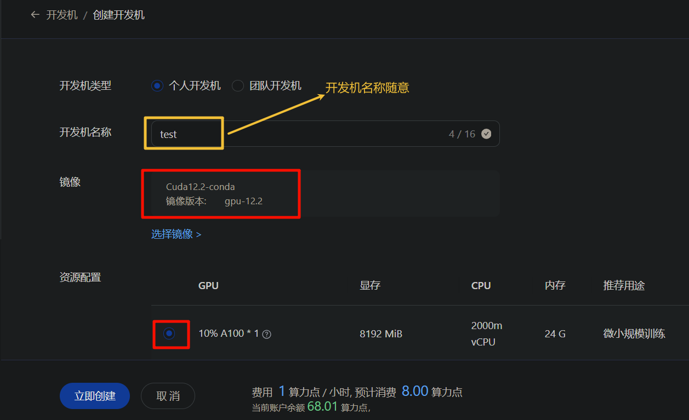
选择创建个人开发机，名称为test，Cuda版本为12.2，资源配置选择10%，选择 【立即创建】

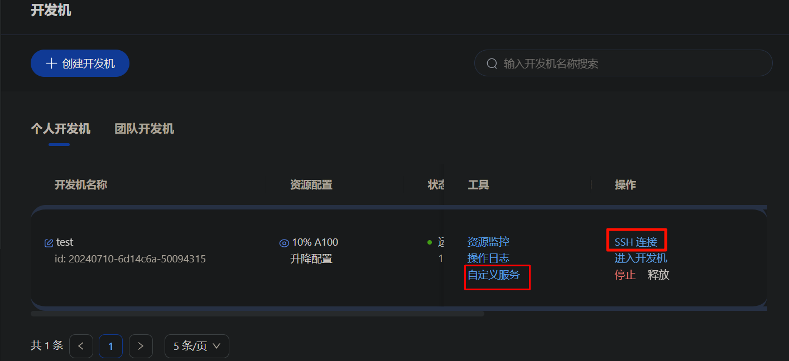

选择【SSH连接】或【自定义服务】(【自定义服务】具有更详细的信息，包括配置vscode端口转发 <推荐>)

如果选择【进入开发机】，可以看到开发机的web主页面，开发机有三种模式可以选择：JupyterLab、终端和VScode。本文不使用此方式，使用本地vscode远程开发模式

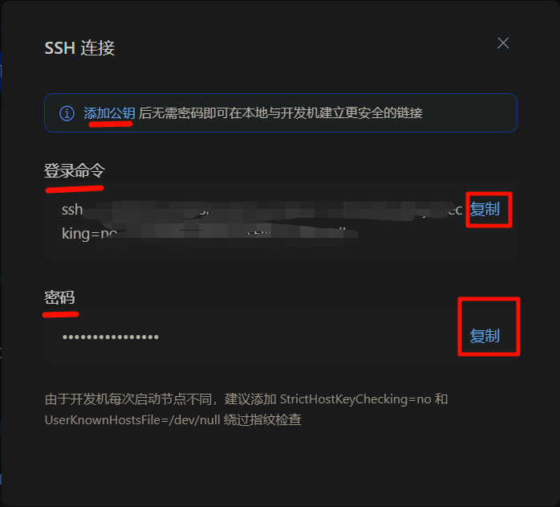

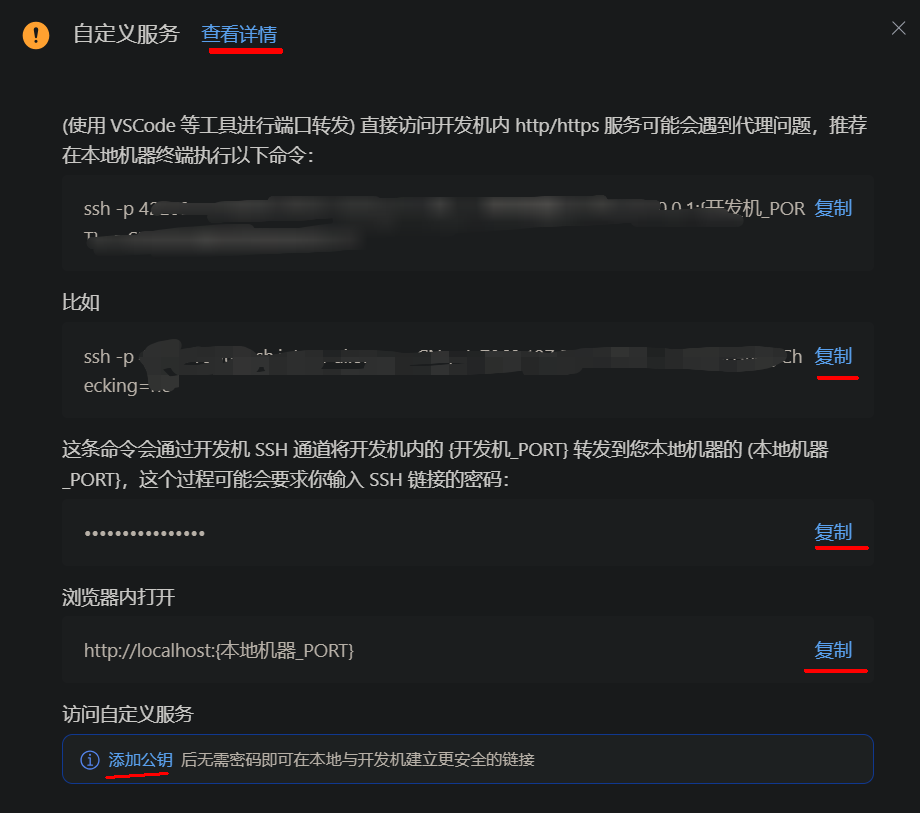


##### 2. 配置ssh

1. 配置ssh密钥

```bash
# 使用RSA算法生成密钥
ssh-keygen -t rsa

```
输入命令后一路回车即可，密钥默认情况下是生成在~/.ssh/目录下。

2. 上传SSH公钥到开发机


> 打开上一步生成的公钥文件 `~/.ssh/id_rsa.pub`，复制内容到图中的【公钥】后，点击【立即添加】
 
3. VScode进行SSH远程连接

打开vscode,安装扩展【Remote - SSH】（网上教程较多，自行配置）
> VScode提供了自动端口映射的功能，不需要手动配置

C:\Users\nonx_\.ssh\config的配置如下：

```bash
# intern
Host intern
  HostName ssh.intern-ai.org.cn
  User root
  Port 42268
  PreferredAuthentications publickey
  IdentityFile ~/.ssh/id_rsa
  StrictHostKeyChecking no
  Compression yes
  UserKnownHostsFile /dev/null
```

参考以下链接

[SSH 进行远程开发](https://code.visualstudio.com/docs/remote/ssh#_remember-hosts-and-advanced-settings)
[SSH config file format ](https://man7.org/linux/man-pages/man5/ssh_config.5.html)

##### 3. 测试本地ssh


#### 闯关任务   | 完成SSH连接与端口映射并运行`hello_world.py`

1. vscode 远程连接开发机
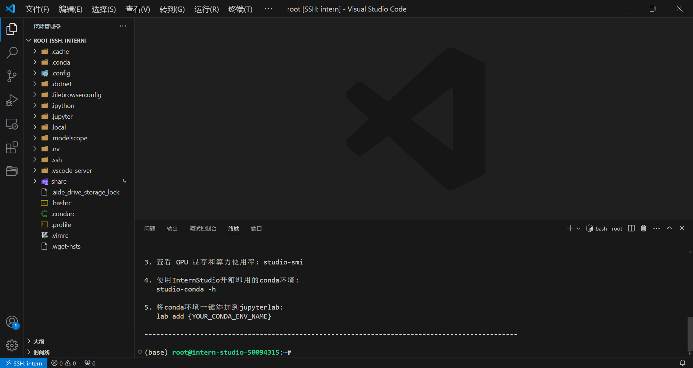


2. 创建文件`hello_world.py`，安装包`pip install gradio==4.29.0`
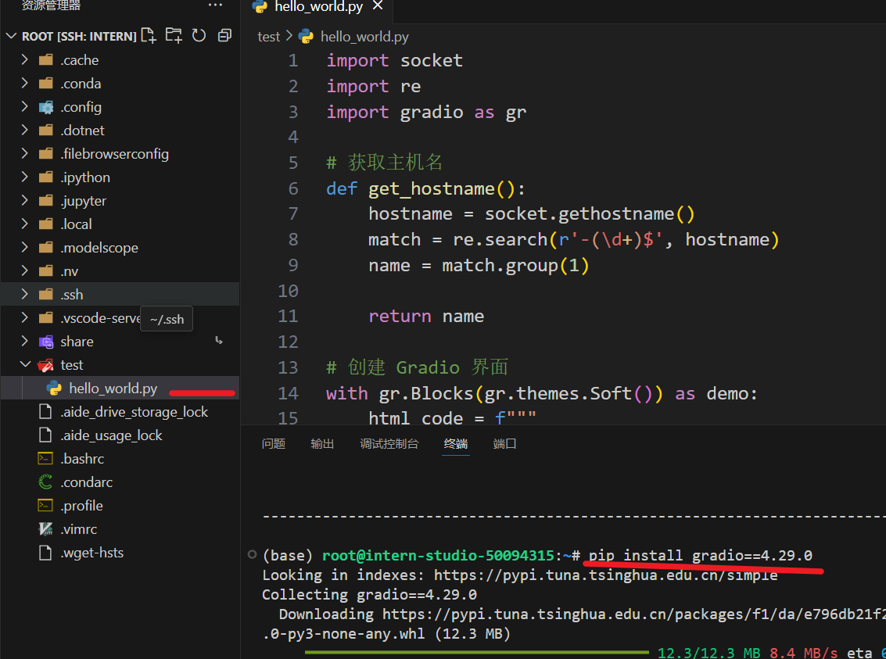

3. 运行hello_world.py


4. 浏览器查看


#### 可选任务 1 | 将Linux基础命令在开发机上完成一遍 

 
 
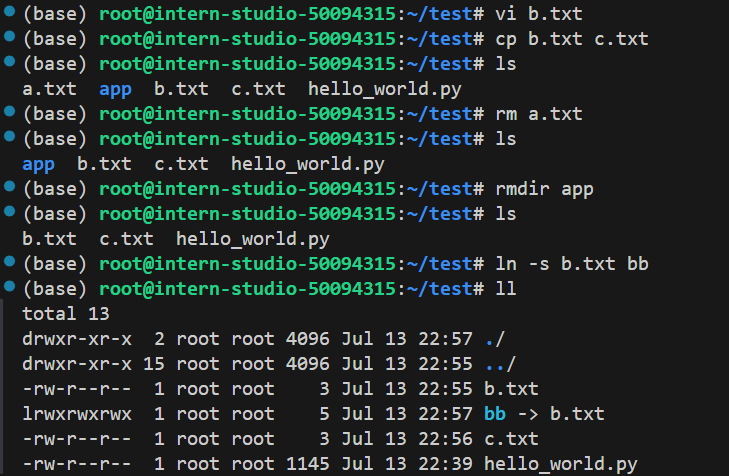


#### 可选任务 2 | 使用 VSCODE 远程连接开发机并创建一个conda环境

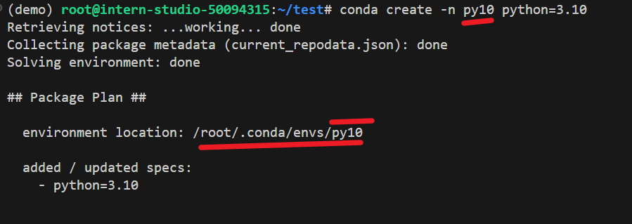
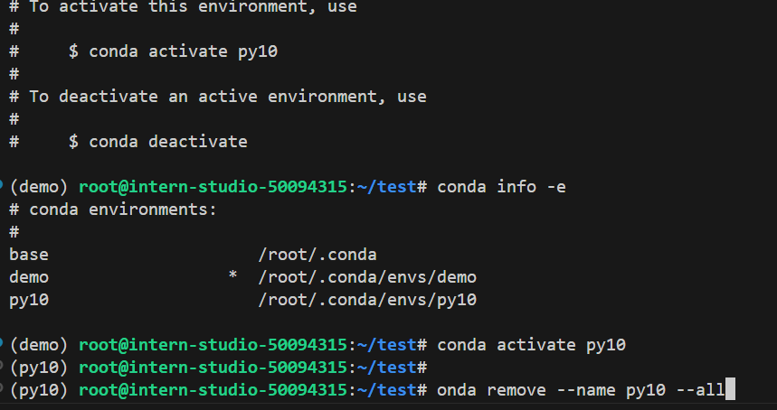

#### 可选任务 3 | 创建并运行`test.sh`文件   

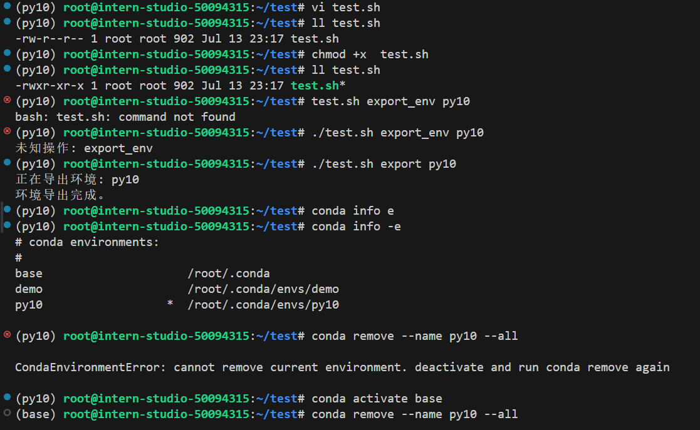

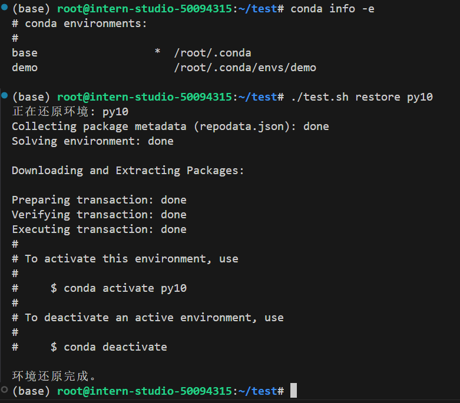


## 第2关 | Python 基础知识 

### 任务
####  任务概览
| 任务类型 | 任务内容 | 预计耗时 |
| --- |---| ---|
|闯关任务|Python实现wordcount| 15mins|
|闯关任务|Vscode连接InternStudio debug笔记| 15mins|

闯关作业总共分为两个任务，两个任务均完成视作闯关成功。
请将作业发布到知乎、CSDN等任一社交媒体，将作业链接提交到以下问卷，助教老师批改后将获得 50 算力点奖励！！！
提交地址：https://aicarrier.feishu.cn/share/base/form/shrcnZ4bQ4YmhEtMtnKxZUcf1vd

####  任务一

请实现一个wordcount函数，统计英文字符串中每个单词出现的次数。返回一个字典，key为单词，value为对应单词出现的次数。

Eg:

Input:

```python
"""Hello world!  
This is an example.  
Word count is fun.  
Is it fun to count words?  
Yes, it is fun!"""
```

Output:

```python
{'hello': 1, 'world': 1, 'this': 1, 'is': 4, 'an': 1, 'example': 1, 'word': 1, 'count': 2, 'fun': 3, 'it': 2, 'to': 1, 'words': 1, 'yes': 1}
```

TIPS：记得先去掉标点符号,然后把每个单词转换成小写。不需要考虑特别多的标点符号，只需要考虑实例输入中存在的就可以。

```python
text = """
Got this panda plush toy for my daughter's birthday,
who loves it and takes it everywhere. It's soft and
super cute, and its face has a friendly look. It's
a bit small for what I paid though. I think there
might be other options that are bigger for the
same price. It arrived a day earlier than expected,
so I got to play with it myself before I gave it
to her.
"""

def wordcount(text):
    pass

```

####  任务二

请使用本地vscode连接远程开发机，将上面你写的wordcount函数在开发机上进行debug，体验debug的全流程，并完成一份debug笔记(需要截图)。


### 文档


#### 闯关任务 -- Python实现wordcount


##### 问题分析：

###### 题意分析
> 请实现一个wordcount函数，统计英文字符串中每个单词出现的次数。返回一个字典，key为单词，value为对应单词出现的次数。

根据题意可知，需要接受一个字符串作为输入，并返回一个字典。字典的键是文本中的单词，值是这些单词出现的次数。

1. 单词转换成小写
2. 去除标点符号
3. 分割单词
4. 计数
5. 返回结果


###### 关键步骤

1. 文本预处理：

- 转换为小写：确保统计时不受单词大小写的影响，将所有文本转换为小写。
- 去除标点符号：因为标点符号可能会影响单词的识别和分割。

2. 分词（Tokenization）：

将预处理后的文本分割成单词列表。这通常基于空格进行，但可能需要更复杂的逻辑来处理特殊情况，如多个连续空格或特殊字符。

3. 单词计数：

使用数据结构（如字典）来存储每个单词及其出现的次数。遍历单词列表，更新字典中的计数。

4. 返回结果：

最终返回包含单词计数的字典或其它数据结构。

##### 解题思路：

- 思路1：字符串方法
使用str.lower()进行小写转换。
使用str.translate()结合str.maketrans()去除标点符号。
使用str.split()按空格分割单词。
使用collections.Counter进行计数。

- 思路2：正则表达式
使用re.findall(r'\b\w+\b')来找到所有单词，这里\b是单词边界，\w+匹配一个或多个字母或数字。
正则表达式提供了一种强大的方式来识别和提取文本中的单词。

- 思路3：逐字符处理
遍历文本中的每个字符，构建单词，遇到非字母数字字符时，完成当前单词的构建并计数，然后开始下一个单词。
这种方法不需要正则表达式或特殊的字符串方法，但可能需要更多的逻辑来正确处理边界情况。

- 思路4：使用自然语言处理库
使用如nltk或spaCy等库，这些库提供了分词（tokenization）功能，可以更准确地处理文本。
这些库考虑了语言的复杂性，可以更好地处理缩写、连字符等特殊情况。
- 思路5：使用流式处理
对于非常大的文本，可以使用生成器逐行或逐块读取文本，然后应用上述任何一种方法进行处理。
这种方法有助于减少内存使用。

#### 闯关任务 -- Vscode连接InternStudio debug笔记

1. vscode连接InternStudio配置【教程多，比较简单，略过】
2. vscode调试python
> 简单调试按【F5】选择`Python Debugger`调试即可，复杂一点需要配置`launch.json `文件

### 作业
#### 闯关任务 -- Python实现wordcount

1. 新建wordcount.py文件 `vi wordcount.py`

```py
# wordcount.py
import string
from collections import Counter
import re

def wordcount(text):
    """
    Count the occurrences of each word in an English string.
    
    Args:
    - text: A string containing English words.
    
    Returns:
    - A dictionary where keys are words and values are the number of occurrences.
    """
    # Remove punctuation and convert to lowercase
    translator = str.maketrans('', '', string.punctuation)
    cleaned_text = text.translate(translator).lower()
    
    # Find all words using regex to handle boundaries properly
    words = re.findall(r'\b\w+\b', cleaned_text)
    
    # Count the occurrences of each word
    word_counts = Counter(words)
    
    # Convert Counter object to a dictionary
    return dict(word_counts)

# Example usage
if __name__ == '__main__':
    text = """
    Got this panda plush toy for my daughter's birthday,
    who loves it and takes it everywhere. It's soft and
    super cute, and its face has a friendly look. It's
    a bit small for what I paid though. I think there
    might be other options that are bigger for the
    same price. It arrived a day earlier than expected,
    so I got to play with it myself before I gave it
    to her.
    """
    print(wordcount(text))
```

2. 运行结果

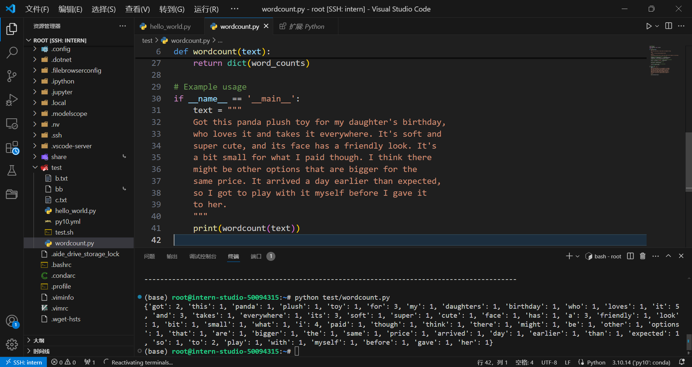

- str.translate() 方法去除 text 中的所有标点符号，并将结果转换为小写。
- 正则表达式分割单词。
- Counter 对象计数
- 返回字典

> 以下是结构化写法，分别使用4种方法实现wordcount  【非任务需求，仅供学习交流】

```py
# wordcount._pro.py
import string
from collections import Counter
import re

def preprocess_text(text):
    """Remove punctuation and convert to lowercase."""
    translator = str.maketrans('', '', string.punctuation)
    return text.translate(translator).lower()

def wordcount_translate(text):
    """Count words using translate method."""
    counter = Counter(preprocess_text(text).split())
    return dict(counter)

def wordcount_re_findall(text):
    """Count words using regular expression."""
    counter = Counter(re.findall(r'\b\w+\b', preprocess_text(text)))
    return dict(counter)

def wordcount_splitlines(text):
    """Count words by splitting lines and then words after preprocessing."""
    processed_text = preprocess_text(text)
    counter = Counter(word for line in processed_text.splitlines() for word in line.split())
    return dict(counter)

def wordcount_strip(text):
    """Count words using strip and split on each line after preprocessing."""
    processed_text = preprocess_text(text)
    counter = Counter(word for line in processed_text.splitlines() for word in line.strip().split())
    return dict(counter)

if __name__ == '__main__':
    text = """
    Hello world!
    This is an example.
    Word count is fun.
    Is it fun to count words?
    Yes, it is fun!
    """
    
    print(wordcount_translate(text))
    print(wordcount_re_findall(text))
    print(wordcount_splitlines(text))
    print(wordcount_strip(text))
```

> 运行结果


#### 闯关任务 -- Vscode连接InternStudio debug笔记

1. 调试配置 【多种调试方式，选择合适的一种即可】

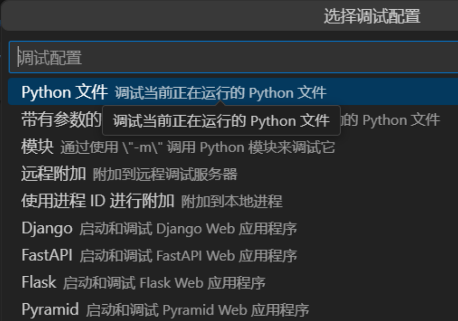


2.  调试Python文件
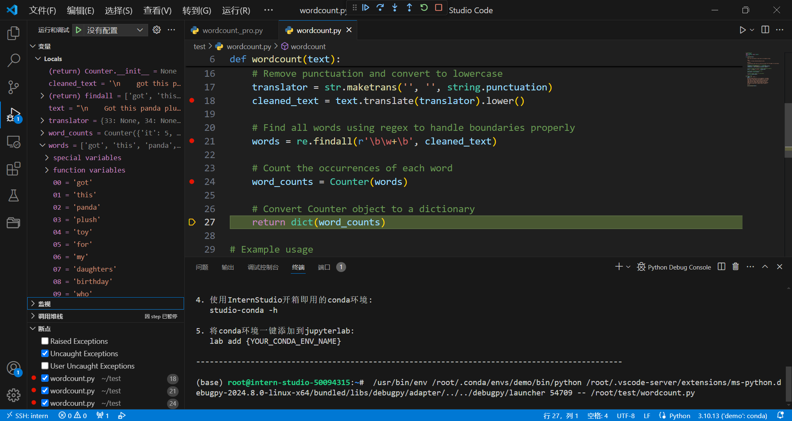


## 第3关 | Git 基础知识  

### 任务

#### 任务概览

- **任务1**: 破冰活动：自我介绍
- **任务2**: 实践项目：构建个人项目

#### 任务1: 破冰活动：自我介绍

##### 目标

每位参与者提交一份自我介绍。
提交地址：https://github.com/InternLM/Tutorial 的 camp3 分支～


##### 要求

1. 命名格式为 `camp3_<id>.md`，其中 `<id>` 是您的报名问卷ID。
2. 文件路径应为 `./data/Git/task/`。
3. 【大家可以叫我】内容可以是 GitHub 昵称、微信昵称或其他网名。
4. 在 GitHub 上创建一个 Pull Request，提供对应的 PR 链接。


#### 任务2: 实践项目：构建个人项目

##### 目标

创建一个个人仓库，用于提交笔记、心得体会或分享项目。


##### 要求

1. 创建并维护一个公开的大模型相关项目或笔记仓库。
2. 提交作业时，提供您的 GitHub 仓库链接。
3. 如果您不常使用 GitHub，您可以选择其他代码管理平台，如 Gitee，并提交相应的链接。
4. 仓库介绍中添加超链接跳转 [GitHub 仓库](https://github.com/InternLM/Tutorial)（<u>[https://github.com/InternLM/Tutorial](https://github.com/InternLM/Tutorial)</u>）
5. 将此项目报名参加第三期实战营项目评选将解锁 30% A100 和 168 团队算力点资源，报名链接：[https://aicarrier.feishu.cn/wiki/DjY6whCO0inTu2kQN9Cchxgynme](https://aicarrier.feishu.cn/wiki/DjY6whCO0inTu2kQN9Cchxgynme)


#### 闯关材料提交

将Pull Request链接闯关材料提交到以下问卷，助教老师批改后将获得 50 算力点奖励！！！，完成项目申报后请联系浦语小助手（微信ID：InternLM）申请额外的团队项目算力资源～

提交地址：[https://aicarrier.feishu.cn/share/base/form/shrcnZ4bQ4YmhEtMtnKxZUcf1vd](https://aicarrier.feishu.cn/share/base/form/shrcnZ4bQ4YmhEtMtnKxZUcf1vd)

### 文档


### 作业

#### 任务1: 破冰活动：自我介绍

1. Fork 目标项目 【https://github.com/InternLM/Tutorial】
2. 本地打开终端，输入以下内容

``` bash
git clone https://github.com/<github用户名>/Tutorial.git # 修改为自己frok的仓库
cd Tutorial/
git branch -a  # 列出本地和远程的所有分支
git checkout -b camp3 origin/camp3  # 切换分支
git checkout -b camp3_<id> # 自定义一个新的分支, id改为自己的
```


> 注：访问GitHub可能失败，需要魔法上网。也可使用gitee替代github
> 本地git配置代理， 替换为自己的代理


3. 创建自述文件

``` bash
touch ./data/Git/task/camp3_<id>.md # 创建自述文件，id改为自己的
```

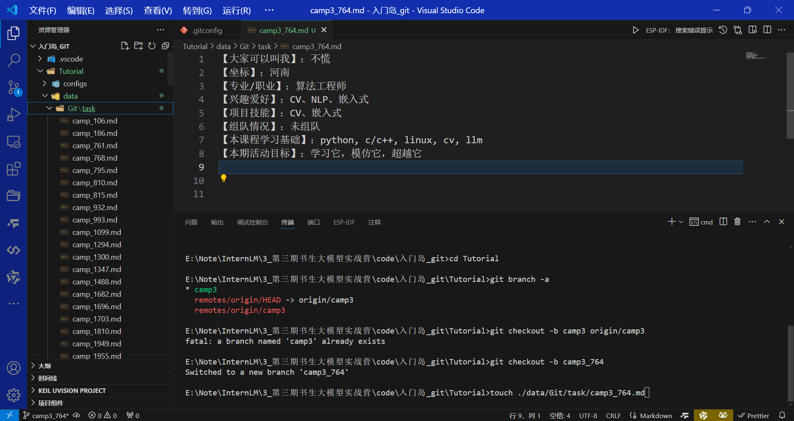

4. 提交自述文件到分支

```bash
git add .
git commit -m "add git_764_introduction" # 提交信息记录
git push origin camp3_764
```

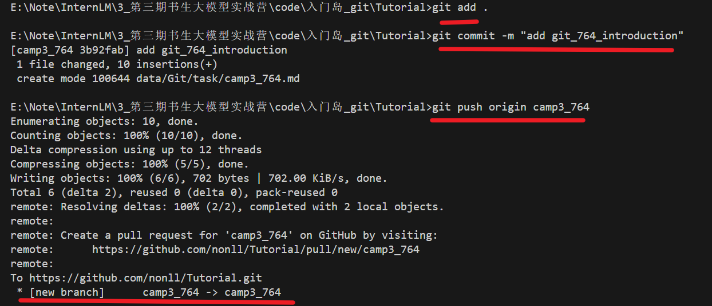

5. 查看提交

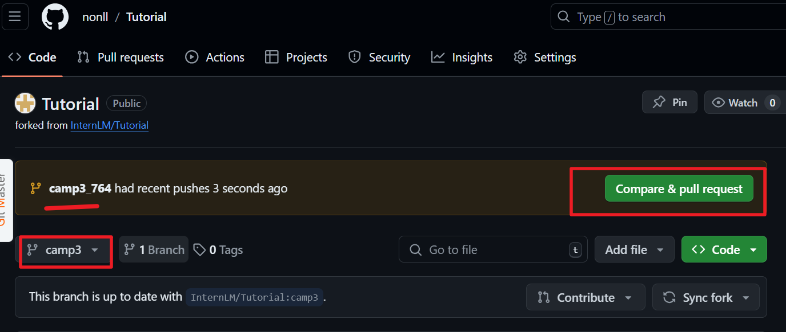

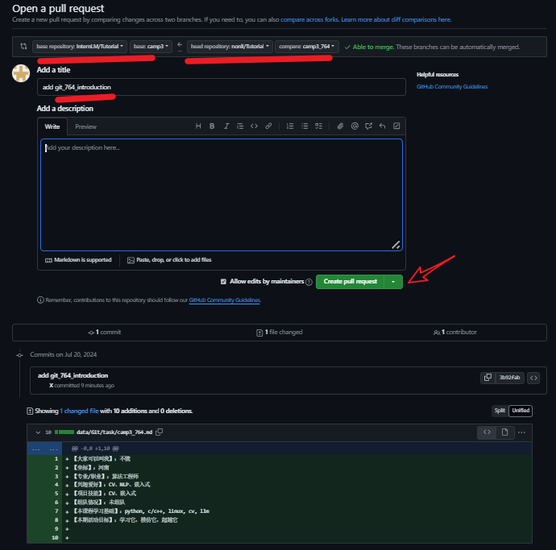

PR链接： https://github.com/InternLM/Tutorial/pull/1225

#### 任务2: 实践项目：构建个人项目

> 第三期书生大模型实战营笔记

仓库链接：

## 参考

[任务-文档 · InternLM/Tutorial (github.com)](https://github.com/InternLM/Tutorial/tree/camp3/docs/L0)

[【InternLM Tutorial】](https://github.com/InternLM/Tutorial)