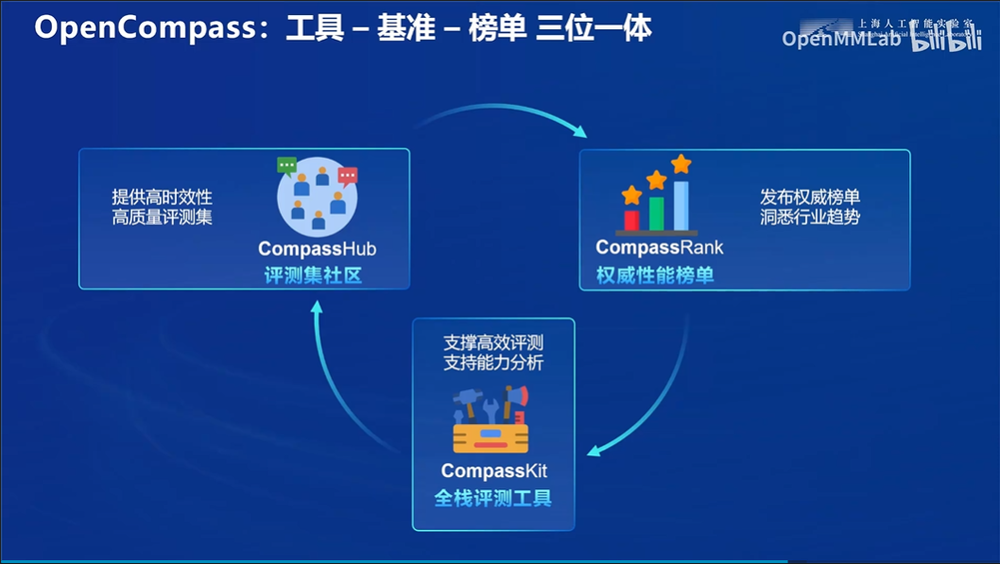

# 第1关 | 书生大模型全链路开源开放体系

## 任务

> [task.md](https://github.com/InternLM/Tutorial/blob/camp3/docs/L1/HelloIntern/task.md)

观看本关卡视频（未上传制作中）后，写一篇关于书生大模型全链路开源开放体系的笔记发布到知乎、CSDN等任一社交媒体，将作业链接提交到以下问卷，助教老师批改后将获得 100 算力点奖励！！！

提交地址：https://aicarrier.feishu.cn/share/base/form/shrcnZ4bQ4YmhEtMtnKxZUcf1vd

## 文档

> [readme.md](https://github.com/InternLM/Tutorial/blob/camp3/docs/L1/HelloIntern/readme.md)

[【B站】书生·浦语大模型全链路开源开放体系](https://www.bilibili.com/video/BV18142187g5/)

## 作业

书生·浦语大模型全链路开源开放体系
> 介绍了书生·浦语大模型及其工具链

### 发展史

### 核心技术思路

### 全链条开源开放体系

数据质量驱动模型性能
大海捞针实验

要点:

- 🌟 英特尔LM2模型，1.8B参数，轻量化，适用于个人开发机。
- 💻 使用InterStudio创建开发环境，实现模型训练和部署。
- 🔎 自由文本图像组合模型，解决复杂视觉语言问题。
- 🎈 lm deploy支持模型压缩、量化、分发，兼容性好。
- 📡 Web demo利用streamlit，轻松展示模型效果。
- 🌈 英特尔VL2模型，综合性能媲美国际闭源商业模型，支持多种模态。
- 🖼️ 图文理解对话功能，演示上传图像和指令输入，体验模型理解能力。
- 🌐 lm deploy支持英特尔l mx composer和英特尔VL2系列模型部署。
- 📝 输入指令和文本，模型即时反馈，展示语言处理效果。
- 🌟 最后，邀请用户为教程点赞，表示感谢与支持。

模型发展：介绍了InternLM2.5的最新版本及其在推理能力、上下文支持和自主规划等方面的提升。
数据处理：描述了数据提取和标注工具，如Miner U和Label LLM。
预训练和微调：InternEvo和XTuner分别在预训练和微调方面的优势。
评测和部署：OpenCompass评测体系和LMDeploy部署工具的特点和优势
智能体：MindSearch智能体和智能体MindSearch的介绍。
企业级知识库：企业级知识库构建工具的介绍。
全链条开源：全链条开源体系的优势和特点
