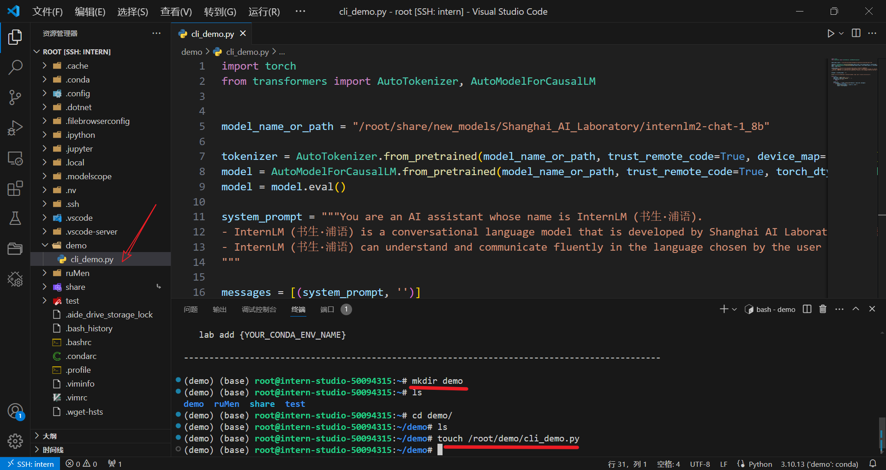
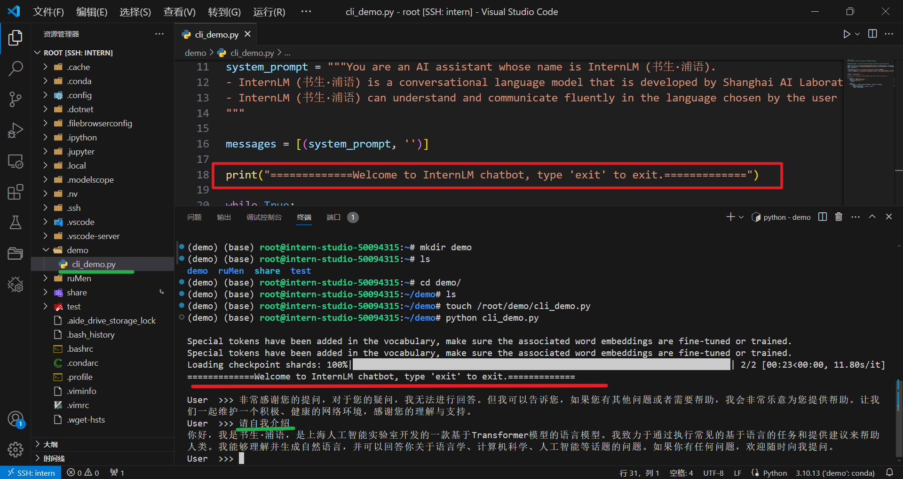
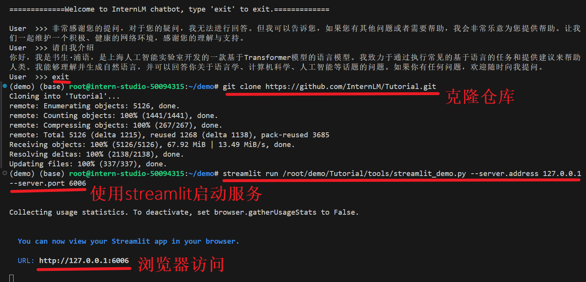
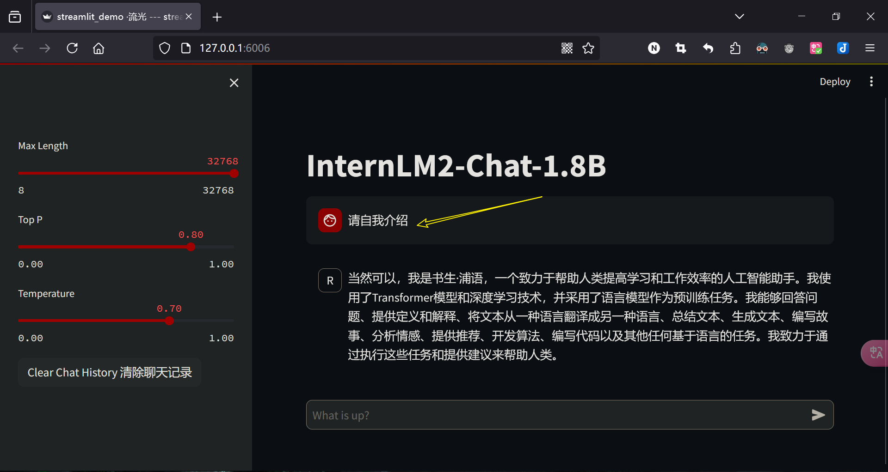
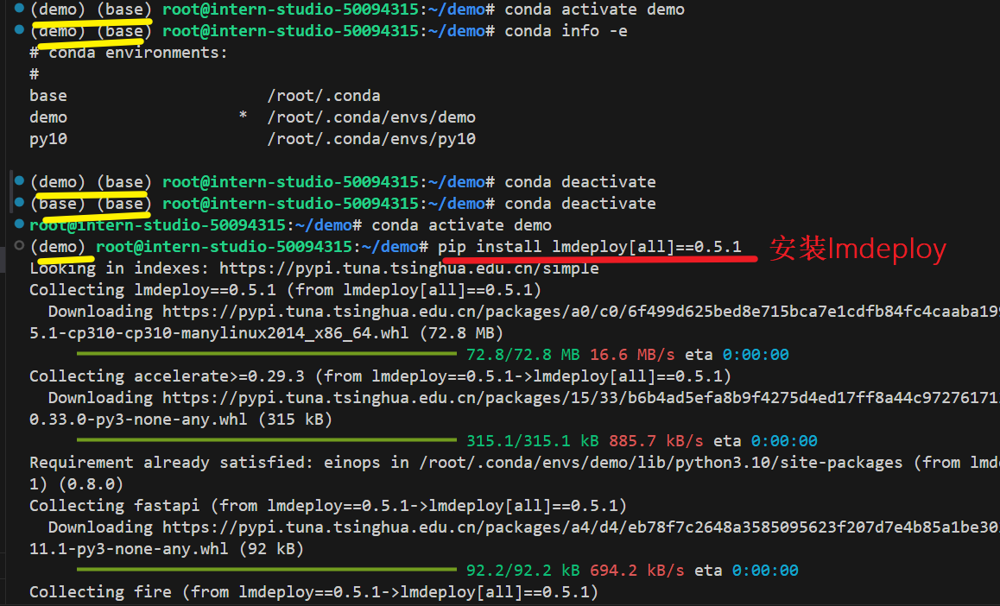
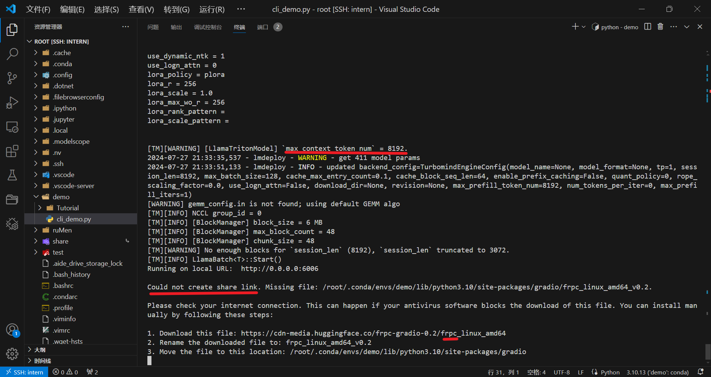
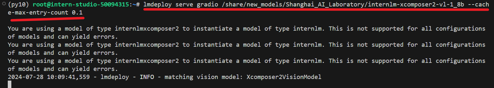
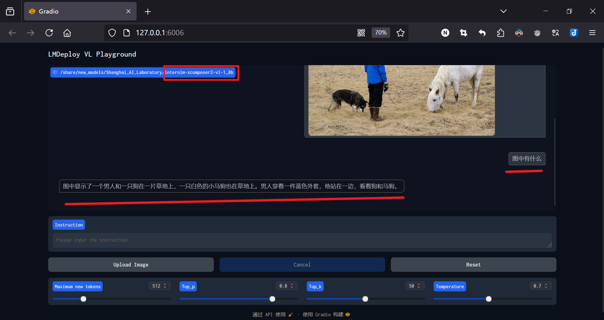
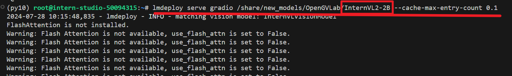
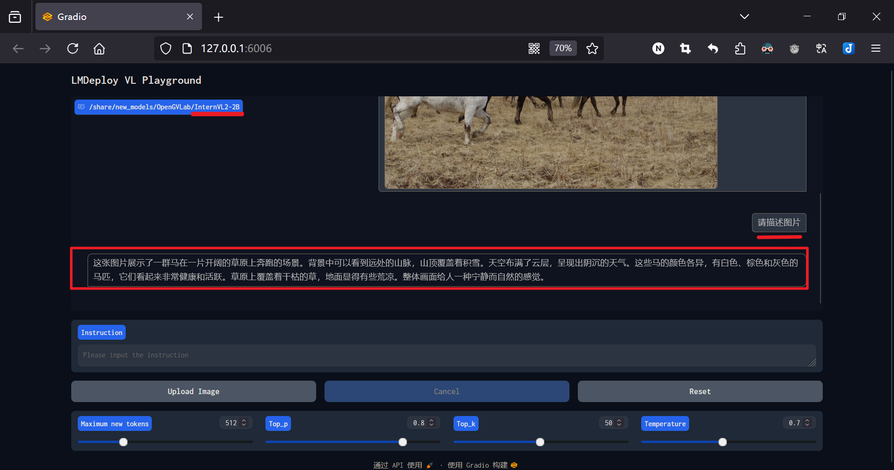

# 第2关 | 8G 显存玩转书生大模型 Demo

## 任务
[task.md](https://github.com/InternLM/Tutorial/blob/camp3/docs/L1/Demo/task.md)
 
> 记录复现过程并截图

### 基础任务（完成此任务即完成闯关）
- 使用 Cli Demo 完成 InternLM2-Chat-1.8B 模型的部署，并生成 300 字小故事，记录复现过程并截图。

### 进阶任务（闯关不要求完成此任务）
- 使用 LMDeploy 完成 InternLM-XComposer2-VL-1.8B 的部署，并完成一次图文理解对话，记录复现过程并截图。
- 使用 LMDeploy 完成 InternVL2-2B 的部署，并完成一次图文理解对话，记录复现过程并截图。

闯关材料提交（完成任务并且提交材料视为闯关成功）
闯关作业总共分为一个任务，一个任务完成视作闯关成功。
请将作业发布到知乎、CSDN等任一社交媒体，将作业链接提交到以下问卷，助教老师批改后将获得 100 算力点奖励！！！

提交地址：https://aicarrier.feishu.cn/share/base/form/shrcnZ4bQ4YmhEtMtnKxZUcf1vd

## 文档
 [readme.md](https://github.com/InternLM/Tutorial/blob/camp3/docs/L1/Demo/readme.md)
> 本关任务主要包括：

1. InternLM2-Chat-1.8B 模型的部署（基础任务）
2. InternLM-XComposer2-VL-1.8B 模型的部署（进阶任务）
3. InternVL2-2B 模型的部署（进阶任务）

### 0. 准备工作

1. 创建开发机并启动（咯）

2. 环境配置

> 创建名为demo的conda环境
```bash
# 创建环境
conda create -n demo python=3.10 -y
# 激活环境
conda activate demo
# 安装 torch
conda install pytorch==2.1.2 torchvision==0.16.2 torchaudio==2.1.2 pytorch-cuda=12.1 -c pytorch -c nvidia -y
# 安装其他依赖
pip install transformers==4.38
pip install sentencepiece==0.1.99
pip install einops==0.8.0
pip install protobuf==5.27.2
pip install accelerate==0.33.0
pip install streamlit==1.37.0
```
### 1. InternLM2-Chat-1.8B 模型的部署（基础任务）

#### 1.1 创建 py文件

1. 创建一个目录demo，用于存放代码。并创建一个 cli_demo.py。

```bash
mkdir -p /root/demo
touch /root/demo/cli_demo.py
```

2. 复制代码到 cli_demo.py

```py
import torch
from transformers import AutoTokenizer, AutoModelForCausalLM


model_name_or_path = "/root/share/new_models/Shanghai_AI_Laboratory/internlm2-chat-1_8b"

tokenizer = AutoTokenizer.from_pretrained(model_name_or_path, trust_remote_code=True, device_map='cuda:0')
model = AutoModelForCausalLM.from_pretrained(model_name_or_path, trust_remote_code=True, torch_dtype=torch.bfloat16, device_map='cuda:0')
model = model.eval()

system_prompt = """You are an AI assistant whose name is InternLM (书生·浦语).
- InternLM (书生·浦语) is a conversational language model that is developed by Shanghai AI Laboratory (上海人工智能实验室). It is designed to be helpful, honest, and harmless.
- InternLM (书生·浦语) can understand and communicate fluently in the language chosen by the user such as English and 中文.
"""

messages = [(system_prompt, '')]

print("=============Welcome to InternLM chatbot, type 'exit' to exit.=============")

while True:
    input_text = input("\nUser  >>> ")
    input_text = input_text.replace(' ', '')
    if input_text == "exit":
        break

    length = 0
    for response, _ in model.stream_chat(tokenizer, input_text, messages):
        if response is not None:
            print(response[length:], flush=True, end="")
            length = len(response)
```

#### 1.2 启动 Demo

> 运行`python /root/demo/cli_demo.py` 来启动 `Demo`

> 跳转到 [【作业】1. InternLM2-Chat-1.8B 模型的部署（基础任务）](#1-1)

#### 1.3 Streamlit 部署 InternLM2-Chat-1.8B 模型
> 使用 Streamlit 部署 InternLM2-Chat-1.8B 模型

1. 克隆仓库到本地

```bash
cd /root/demo
git clone https://github.com/InternLM/Tutorial.git
```

2. 启动一个 Streamlit 服务

```bash
cd /root/demo
streamlit run /root/demo/Tutorial/tools/streamlit_demo.py --server.address 127.0.0.1 --server.port 6006
```

3. 将端口映射到本地 【使用PowerShell 】

```bash
ssh -CNg -L 6006:127.0.0.1:6006 root@ssh.intern-ai.org.cn -p 你的 ssh 端口号

# 输入ssh密码或者使用密钥
```

4.  效果如下

> 跳转到  [【作业】1. InternLM2-Chat-1.8B 模型的部署（基础任务）](#1-2)

> 注： 如果遇到了 OSError: [Errno 28] inotify watch limit reached 的问题，请不要慌张。稍等一段时间后重新执行即可。

### 2. InternLM-XComposer2-VL-1.8B 模型的部署（进阶任务）

>使用 LMDeploy 部署 InternLM-XComposer2-VL-1.8B 模型

#### 1. 简介InternLM-XComposer2 和LMDeploy
> InternLM-XComposer2 是一款基于 InternLM2 的视觉语言大模型，其擅长自由形式的文本图像合成和理解。其主要特点包括：

自由形式的交错文本图像合成：InternLM-XComposer2 可以根据大纲、详细文本要求和参考图像等不同输入，生成连贯且上下文相关，具有交错图像和文本的文章，从而实现高度可定制的内容创建。
准确的视觉语言问题解决：InternLM-XComposer2 基于自由形式的指令准确地处理多样化和具有挑战性的视觉语言问答任务，在识别，感知，详细标签，视觉推理等方面表现出色。
令人惊叹的性能：基于 InternLM2-7B 的InternLM-XComposer2 在多个基准测试中位于开源多模态模型第一梯队，而且在部分基准测试中与 GPT-4V 和 Gemini Pro 相当甚至超过它们。

> LMDeploy 是一个用于压缩、部署和服务 LLM 的工具包，由 MMRazor 和 MMDeploy 团队开发。它具有以下核心功能：

高效的推理：LMDeploy 通过引入持久化批处理、块 KV 缓存、动态分割与融合、张量并行、高性能 CUDA 内核等关键技术，提供了比 vLLM 高 1.8 倍的推理性能。
有效的量化：LMDeploy 支持仅权重量化和 k/v 量化，4bit 推理性能是 FP16 的 2.4 倍。量化后模型质量已通过 OpenCompass 评估确认。
轻松的分发：利用请求分发服务，LMDeploy 可以在多台机器和设备上轻松高效地部署多模型服务。
交互式推理模式：通过缓存多轮对话过程中注意力的 k/v，推理引擎记住对话历史，从而避免重复处理历史会话。
优秀的兼容性：LMDeploy支持 KV Cache Quant，AWQ 和自动前缀缓存同时使用。
LMDeploy 已经支持了 InternLM-XComposer2 系列的部署，但值得注意的是 LMDeploy 仅支持了 InternLM-XComposer2 系列模型的视觉对话功能。

#### 2. 环境配置

-  激活环境并安装相关依赖
 
```bash
conda activate demo
pip install lmdeploy[all]==0.5.1
pip install timm==1.0.7
```

#### 3. 启动Gradio 服务
> 使用 LMDeploy 启动一个与 InternLM-XComposer2-VL-1.8B 模型交互的 Gradio 服务

```bash
lmdeploy serve gradio /share/new_models/Shanghai_AI_Laboratory/internlm-xcomposer2-vl-1_8b --cache-max-entry-count 0.1
```
#### 4. 运行
> 使用 Upload Image 上传图片后，我们输入 Instruction 后按下回车，便可以看到模型的输出

> 跳转到 [【作业】2. InternLM-XComposer2-VL-1.8B 模型的部署（进阶任务）](#2-1)

### 3. InternVL2-2B 模型的部署（进阶任务）

InternVL2 是上海人工智能实验室推出的新一代视觉-语言多模态大模型，是首个综合性能媲美国际闭源商业模型的开源多模态大模型。InternVL2 系列从千亿大模型到端侧小模型全覆盖，通专融合，支持多种模态。

LMDeploy 也已经支持了 InternVL2 系列模型的部署，让我们一起来使用 LMDeploy 部署 InternVL2-2B 模型。

1. 启动 InternVL2-2B 模型的 Gradio 服务

```bash
conda activate demo
lmdeploy serve gradio /share/new_models/OpenGVLab/InternVL2-2B --cache-max-entry-count 0.1
```
2. 在完成端口映射后，我们便可以通过浏览器访问 `http://localhost:6006` 来启动我们的 Demo。

3. 使用 Upload Image 上传图片后，我们输入 Instruction 后按下回车，便可以看到模型的输出

> 跳转到 [【作业】3. InternVL2-2B 模型的部署（进阶任务）](#3-1)

## 作业
> 本关任务主要包括：

1. InternLM2-Chat-1.8B 模型的部署（基础任务）
2. InternLM-XComposer2-VL-1.8B 模型的部署（进阶任务）
3. InternVL2-2B 模型的部署（进阶任务）


### 1. InternLM2-Chat-1.8B 模型的部署（基础任务）

#### 1. 创建cli_demo.py


#### 2. 启动 Demo 【较慢，耐心等待】

<a name="1-1"></a>
启动 Demo



<a name="1-2"></a>
#### 3. Streamlit 部署 InternLM2-Chat-1.8B 模型





### 2. InternLM-XComposer2-VL-1.8B 模型的部署（进阶任务）

#### 1. 安装lmdeploy
> 注意：conda环境嵌套【图中黄线部分】




#### 2.  启动Gradio 服务






#### 3. 运行
<a name="2-1"></a>
使用 LMDeploy 启动一个与 InternLM-XComposer2-VL-1.8B 模型交互的 Gradio 服务



### 3. InternVL2-2B 模型的部署（进阶任务）

<a name="3-1"></a>



