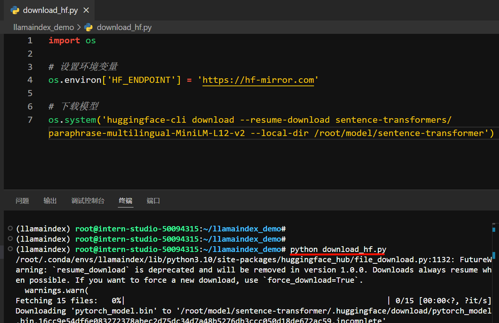
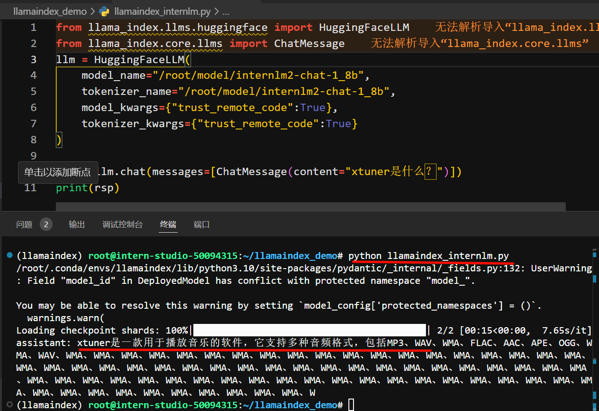

# 第4关 | InternLM + LlamaIndex RAG 实践

## 任务

> [task.md](https://github.com/InternLM/Tutorial/blob/camp3/docs/L1/HelloIntern/task.md)

基础任务 (完成此任务即完成闯关)  

任务要求：基于 LlamaIndex 构建自己的 RAG 知识库，寻找一个问题 A 在使用 LlamaIndex 之前InternLM2-Chat-1.8B模型不会回答，借助 LlamaIndex 后 InternLM2-Chat-1.8B 模型具备回答 A 的能力，截图保存。  

闯关材料提交 (完成任务并且提交材料时为闯关成功)
请将作业发布到知乎、CSDN等任一社交媒体，将作业链接提交到以下问卷，助教老师批改后将获得 100 算力点奖励！！！

提交地址：https://aicarrier.feishu.cn/share/base/form/shrcnZ4bQ4YmhEtMtnKxZUcf1vd

## 文档

> [readme.md](https://github.com/InternLM/Tutorial/blob/camp3/docs/L1/HelloIntern/readme.md)
### 0. 配置环境安装依赖包

```py
 # 创建环境
conda create -n llamaindex python=3.10
conda activate llamaindex
conda install pytorch==2.0.1 torchvision==0.15.2 torchaudio==2.0.2 pytorch-cuda=11.7 -c pytorch -c nvidia

# 安装依赖包
pip install einops==0.7.0 protobuf==5.26.1
```

### 1. 下载配置模型

1. 安装 Llamaindex和相关的包

```py
conda activate llamaindex
pip install llama-index==0.10.38 llama-index-llms-huggingface==0.2.0 "transformers[torch]==4.41.1" "huggingface_hub[inference]==0.23.1" huggingface_hub==0.23.1 sentence-transformers==2.7.0 sentencepiece==0.2.0
```

2. 下载 Sentence Transformer 模型

`vi cd ~/llamaindex_demo/download_hf.py`,创建文件，内容如下：
```py
import os

# 设置环境变量
os.environ['HF_ENDPOINT'] = 'https://hf-mirror.com'

# 下载模型
os.system('huggingface-cli download --resume-download sentence-transformers/paraphrase-multilingual-MiniLM-L12-v2 --local-dir /root/model/sentence-transformer')
```

```bash
# 下载 Sentence Transformer 模型
conda activate llamaindex
python download_hf.py
```
3. 下载 NLTK 相关资源

```bash
cd /root
git clone https://gitee.com/yzy0612/nltk_data.git  --branch gh-pages
cd nltk_data
mv packages/*  ./
cd tokenizers
unzip punkt.zip
cd ../taggers
unzip averaged_perceptron_tagger.zip
```

### 2. LlamaIndex HuggingFaceLLM

```bash
# 创建软链
cd ~/model
ln -s /root/share/new_models/Shanghai_AI_Laboratory/internlm2-chat-1_8b/ ./
# 新建py文件
cd ~/llamaindex_demo
touch llamaindex_internlm.py
```

```py
# llamaindex_internlm.py
from llama_index.llms.huggingface import HuggingFaceLLM
from llama_index.core.llms import ChatMessage
llm = HuggingFaceLLM(
    model_name="/root/model/internlm2-chat-1_8b",
    tokenizer_name="/root/model/internlm2-chat-1_8b",
    model_kwargs={"trust_remote_code":True},
    tokenizer_kwargs={"trust_remote_code":True}
)

rsp = llm.chat(messages=[ChatMessage(content="xtuner是什么？")])
print(rsp)
```

```bash
conda activate llamaindex
cd ~/llamaindex_demo/
python llamaindex_internlm.py
```

### 3. LlamaIndex RAG

```bash
# 1. 安装 LlamaIndex 词嵌入向量依赖
conda activate llamaindex
pip install llama-index-embeddings-huggingface==0.2.0 llama-index-embeddings-instructor==0.1.3

# 2. 获取知识库
cd ~/llamaindex_demo
mkdir data
cd data
git clone https://github.com/InternLM/xtuner.git
mv xtuner/README_zh-CN.md ./

# 3.新建一个python文件
cd ~/llamaindex_demo
touch llamaindex_RAG.py
```

```py
# llamaindex_RAG.py
from llama_index.core import VectorStoreIndex, SimpleDirectoryReader, Settings

from llama_index.embeddings.huggingface import HuggingFaceEmbedding
from llama_index.llms.huggingface import HuggingFaceLLM

#初始化一个HuggingFaceEmbedding对象，用于将文本转换为向量表示
embed_model = HuggingFaceEmbedding(
#指定了一个预训练的sentence-transformer模型的路径
    model_name="/root/model/sentence-transformer"
)
#将创建的嵌入模型赋值给全局设置的embed_model属性，
#这样在后续的索引构建过程中就会使用这个模型。
Settings.embed_model = embed_model

llm = HuggingFaceLLM(
    model_name="/root/model/internlm2-chat-1_8b",
    tokenizer_name="/root/model/internlm2-chat-1_8b",
    model_kwargs={"trust_remote_code":True},
    tokenizer_kwargs={"trust_remote_code":True}
)
#设置全局的llm属性，这样在索引查询时会使用这个模型。
Settings.llm = llm

#从指定目录读取所有文档，并加载数据到内存中
documents = SimpleDirectoryReader("/root/llamaindex_demo/data").load_data()
#创建一个VectorStoreIndex，并使用之前加载的文档来构建索引。
# 此索引将文档转换为向量，并存储这些向量以便于快速检索。
index = VectorStoreIndex.from_documents(documents)
# 创建一个查询引擎，这个引擎可以接收查询并返回相关文档的响应。
query_engine = index.as_query_engine()
response = query_engine.query("xtuner是什么?")

print(response)
```

```bash
# 运行
conda activate llamaindex
cd ~/llamaindex_demo/
python llamaindex_RAG.py
```

### 4. LlamaIndex web

```bash
# 安装依赖
pip install streamlit==1.36.0
cd ~/llamaindex_demo
touch app.py
```

```py
# app.py
import streamlit as st
from llama_index.core import VectorStoreIndex, SimpleDirectoryReader, Settings
from llama_index.embeddings.huggingface import HuggingFaceEmbedding
from llama_index.llms.huggingface import HuggingFaceLLM

st.set_page_config(page_title="llama_index_demo", page_icon="🦜🔗")
st.title("llama_index_demo")

# 初始化模型
@st.cache_resource
def init_models():
    embed_model = HuggingFaceEmbedding(
        model_name="/root/model/sentence-transformer"
    )
    Settings.embed_model = embed_model

    llm = HuggingFaceLLM(
        model_name="/root/model/internlm2-chat-1_8b",
        tokenizer_name="/root/model/internlm2-chat-1_8b",
        model_kwargs={"trust_remote_code": True},
        tokenizer_kwargs={"trust_remote_code": True}
    )
    Settings.llm = llm

    documents = SimpleDirectoryReader("/root/llamaindex_demo/data").load_data()
    index = VectorStoreIndex.from_documents(documents)
    query_engine = index.as_query_engine()

    return query_engine

# 检查是否需要初始化模型
if 'query_engine' not in st.session_state:
    st.session_state['query_engine'] = init_models()

def greet2(question):
    response = st.session_state['query_engine'].query(question)
    return response

      
# Store LLM generated responses
if "messages" not in st.session_state.keys():
    st.session_state.messages = [{"role": "assistant", "content": "你好，我是你的助手，有什么我可以帮助你的吗？"}]    

    # Display or clear chat messages
for message in st.session_state.messages:
    with st.chat_message(message["role"]):
        st.write(message["content"])

def clear_chat_history():
    st.session_state.messages = [{"role": "assistant", "content": "你好，我是你的助手，有什么我可以帮助你的吗？"}]

st.sidebar.button('Clear Chat History', on_click=clear_chat_history)

# Function for generating LLaMA2 response
def generate_llama_index_response(prompt_input):
    return greet2(prompt_input)

# User-provided prompt
if prompt := st.chat_input():
    st.session_state.messages.append({"role": "user", "content": prompt})
    with st.chat_message("user"):
        st.write(prompt)

# Gegenerate_llama_index_response last message is not from assistant
if st.session_state.messages[-1]["role"] != "assistant":
    with st.chat_message("assistant"):
        with st.spinner("Thinking..."):
            response = generate_llama_index_response(prompt)
            placeholder = st.empty()
            placeholder.markdown(response)
    message = {"role": "assistant", "content": response}
    st.session_state.messages.append(message)
```

运行`streamlit run app.py`，进入网页

## 作业

1.  下载 Sentence Transformer 模型


2.  llamaindex_internlm 回答 xtuner是什么


