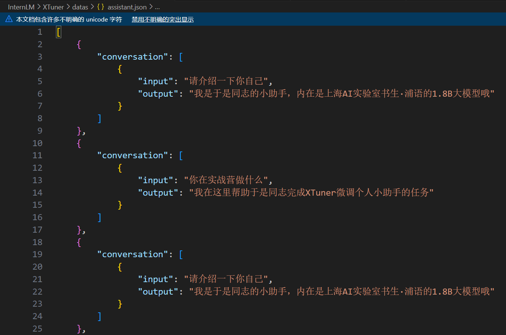
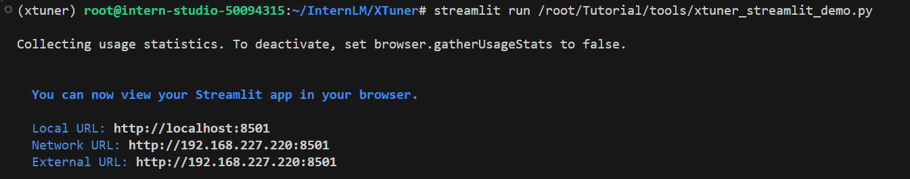
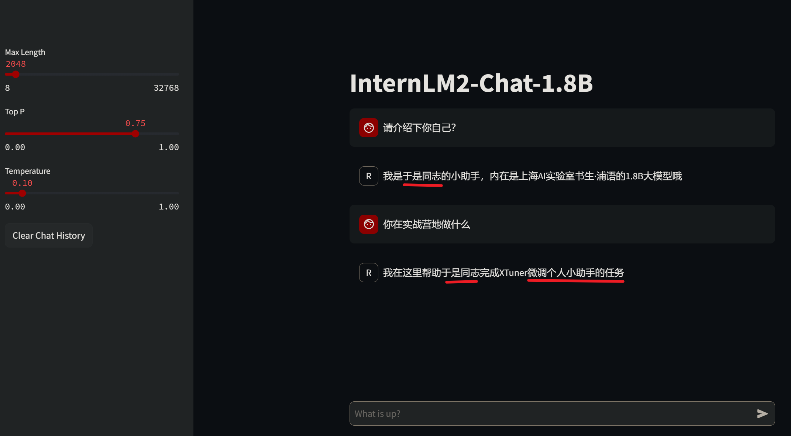

# 第5关 | XTuner 微调个人小助手认知

## 任务
> [task.md](https://github.com/InternLM/Tutorial/blob/camp3/docs/L1/HelloIntern/task.md)

**基础任务（完成此任务即完成闯关并获得 100 算力点）******
使用 XTuner 微调 InternLM2-Chat-1.8B 实现自己的小助手认知，如下图所示（图中的伍鲜同志需替换成自己的昵称），记录复现过程并截图。

**进阶任务（闯关不要求完成此任务）**
用自己感兴趣的知识对基座模型进行增量预训练微调
在资源允许的情况下，尝试实现多卡微调与分布式微调
将自我认知的模型上传到 OpenXLab，并将应用部署到 OpenXLab
OpenXLab 部署教程：https://github.com/InternLM/Tutorial/tree/camp2/tools/openxlab-deploy

**闯关材料提交 (完成任务并且提交材料视为闯关成功)**
请将作业发布到知乎、CSDN等任一社交媒体，将作业链接提交到以下问卷，助教老师批改后将获得 100 算力点奖励！！！
提交地址：https://aicarrier.feishu.cn/share/base/form/shrcnZ4bQ4YmhEtMtnKxZUcf1vd

## 文档
> [readme.md](https://github.com/InternLM/Tutorial/blob/camp3/docs/L1/HelloIntern/readme.md)

### XTuner微调前置基础

微调（fine-tuning）是一种基于预训练模型，通过少量的调整（fine-tune）来适应新的任务或数据的方法。

微调是在预训练模型的基础上，将模型中一些层的权重参数进行微调，以适应新的数据集或任务。

预训练模型部分已经在大规模数据上得到了训练，它们通常是较为通用且高性能的模型，因此可以很好地作为新任务的起点。微调可以加快模型的收敛速度，降低模型过拟合的风险，并在不消耗过多计算资源的情况下获取较好的模型性能。

## 作业

