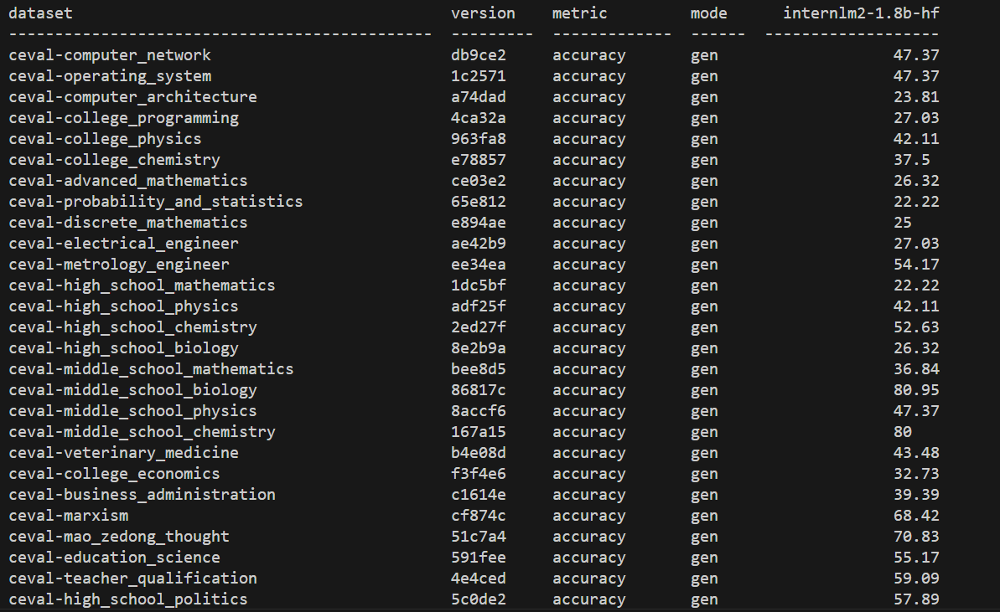
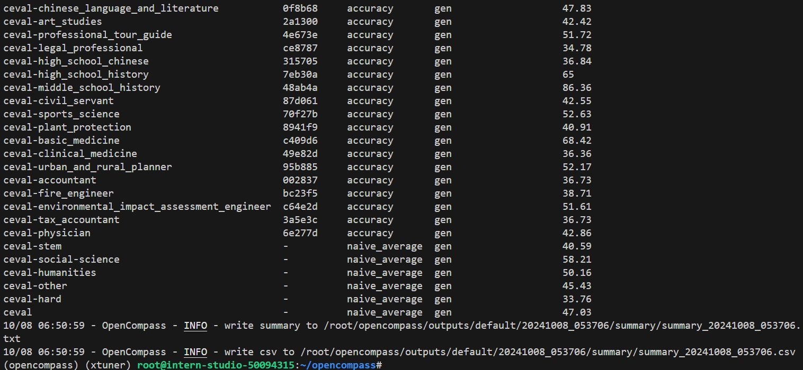

# 第6关 | OpenCompass 评测 InternLM-1.8B 实践

## 任务

> [task.md](https://github.com/InternLM/Tutorial/blob/camp3/docs/L1/OpenCompass/task.md)

- 记录复现过程并截图。

### 基础任务（完成此任务即完成闯关）

- 使用 OpenCompass 评测 internlm2-chat-1.8b 模型在 MMLU 数据集上的性能，记录复现过程并截图。

### 进阶任务（闯关不要求完成此任务）

- 使用 OpenCompass 进行主观评测（选做）
- 使用 OpenCompass 评测 InternLM2-Chat-1.8B 模型使用 LMDeploy部署后在 MMLU 数据集上的性能（选做）
- 使用 OpenCompass 进行调用API评测（优秀学员必做）

### 闯关材料提交（完成任务并且提交材料视为闯关成功）

- 闯关作业总共分为一个任务，一个任务完成视作闯关成功。
- 请将作业发布到知乎、CSDN等任一社交媒体，将作业链接提交到以下问卷，助教老师批改后将获得 50 算力点奖励！！！
- 提交地址：<https://aicarrier.feishu.cn/share/base/form/shrcnZ4bQ4YmhEtMtnKxZUcf1vd>

## 文档

> [readme.md](https://github.com/InternLM/Tutorial/blob/camp3/docs/L1/OpenCompass/readme.md)

### 概览

在 OpenCompass 中评估一个模型通常包括以下几个阶段：配置 -> 推理 -> 评估 -> 可视化。

配置：这是整个工作流的起点。您需要配置整个评估过程，选择要评估的模型和数据集。此外，还可以选择评估策略、计算后端等，并定义显示结果的方式。

推理与评估：在这个阶段，OpenCompass 将会开始对模型和数据集进行并行推理和评估。推理阶段主要是让模型从数据集产生输出，而评估阶段则是衡量这些输出与标准答案的匹配程度。这两个过程会被拆分为多个同时运行的“任务”以提高效率。

可视化：评估完成后，OpenCompass 将结果整理成易读的表格，并将其保存为 CSV 和 TXT 文件。

接下来，我们将展示 OpenCompass 的基础用法，分别用命令行方式和配置文件的方式评测InternLM2-Chat-1.8B，展示书生浦语在 C-Eval 基准任务上的评估。更多评测技巧请查看 <https://opencompass.readthedocs.io/zh-cn/latest/get_started/quick_start.html> 文档。

### 数据准备

1. 评测数据集
2. InternLM和ceval 相关的配置文件

### 启动评测 (10% A100 8GB 资源)

1. 使用命令行配置参数法进行评测
2. 使用配置文件修改参数法进行评测

## 作业

### 评测结果

